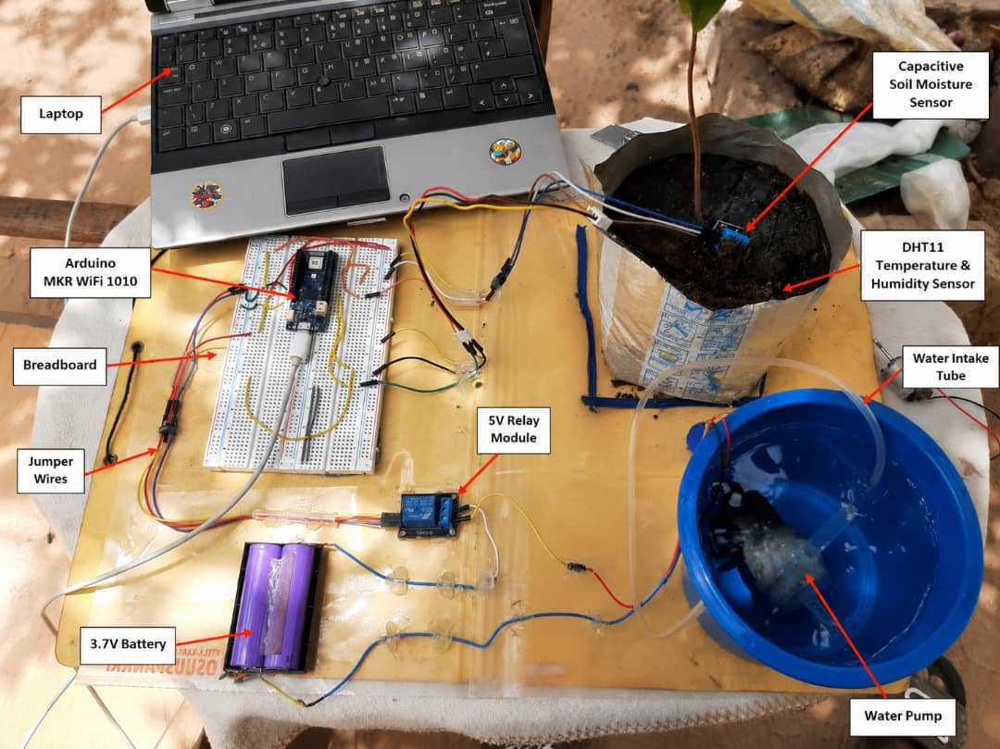
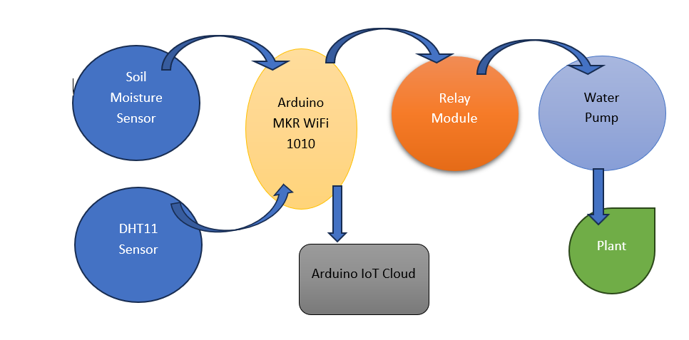
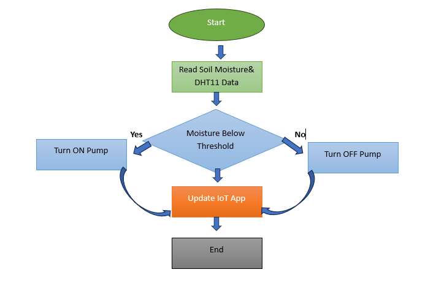
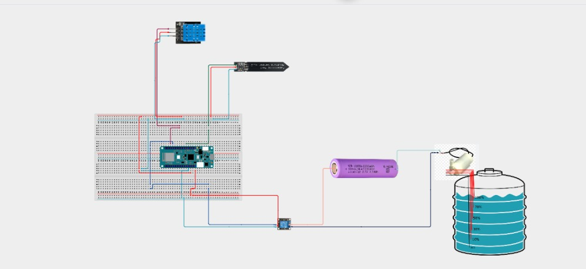
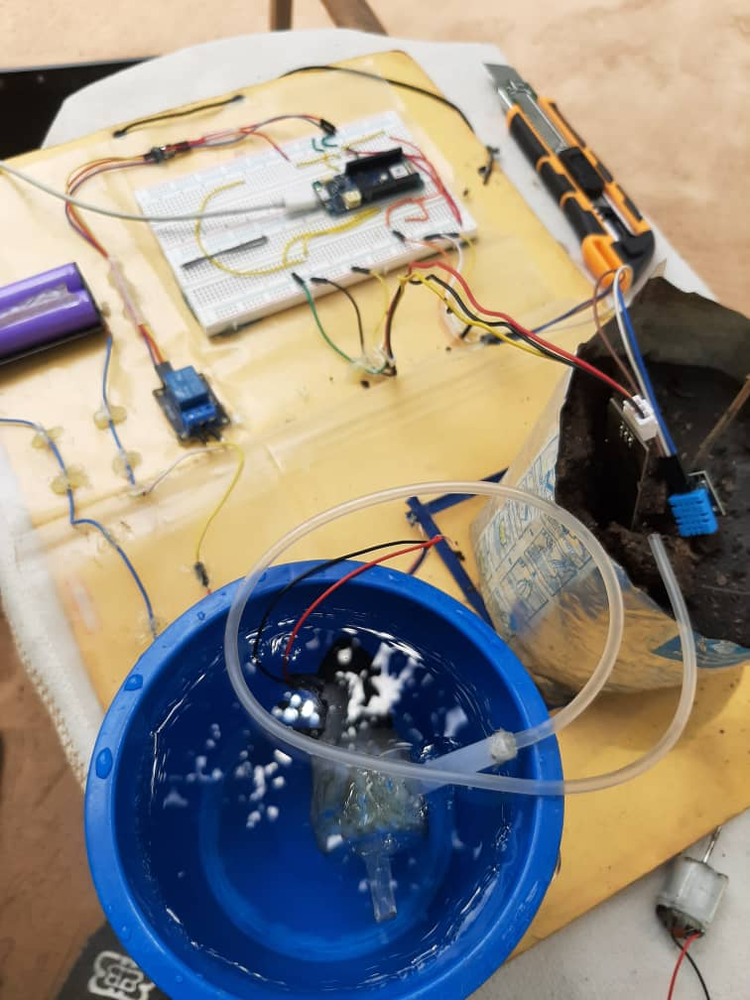
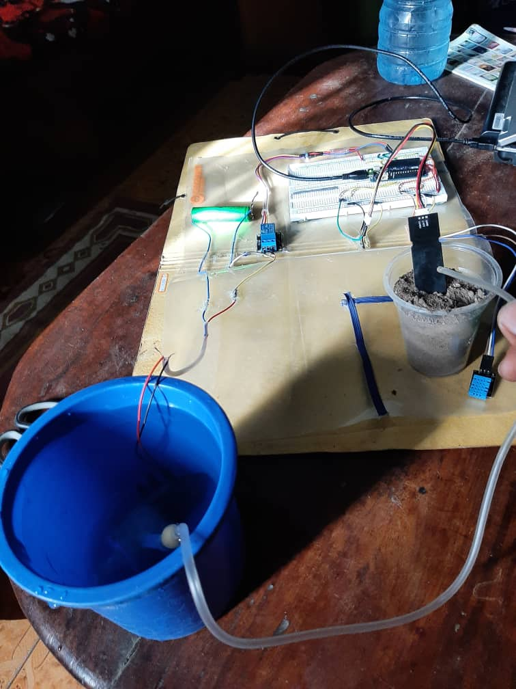
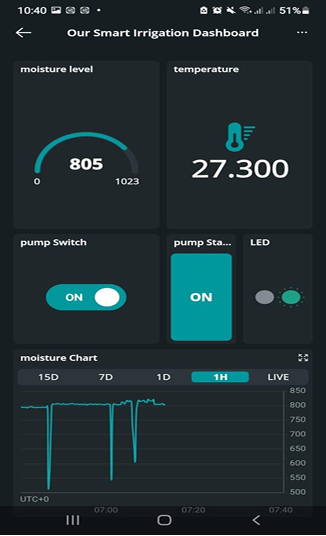

# Smart-iot-irrigation-system
An IoT-based smart irrigation system using Arduino MKR WiFi 1010 for automated Irrigation and remote monitoring
## Project Prototype



## Project Overview

The Smart IoT-Based Irrigation System is an automated agricultural solution designed to improve irrigation efficiency through real-time soil moisture monitoring and intelligent water management.

The system uses an Arduino MKR WiFi 1010 microcontroller, a capacitive soil moisture sensor, a DHT11 sensor, a relay module, and a water pump. Through IoT connectivity, users can monitor environmental conditions and irrigation status remotely.

This project demonstrates the application of embedded systems, automation, sensor integration, and Internet of Things (IoT) technology in agriculture.

## Project Objectives

The main objective of this project is to develop an IoT-based smart irrigation system capable of automatically watering plants based on soil moisture conditions.

### Specific Objectives

- Monitor soil moisture levels in real time.
- Measure temperature  using the DHT11 sensor.
- Automate irrigation using a relay-controlled water pump.
- Enable remote monitoring through IoT connectivity.
- Improve water-use efficiency in agriculture.

## Hardware Components

| Component | Function |
|------------|------------|
| Arduino MKR WiFi 1010 | Main Controller |
| Capacitive Soil Moisture Sensor | Measures soil moisture |
| DHT11 Sensor | Measures temperature  |
| 5V Relay Module | Controls pump operation |
| Water Pump | Supplies water to plants |
| Breadboard | Circuit assembly |
| 3.7V Battery | Power supply |
| Jumper Wires | Electrical connections |

## Repository Structure

```text
Smart-iot-irrigation-system
├── README.md
├── code
│   └── smart_irrigation.ino
├── docs
│   └── SMART_IoT_Portfolio.pdf
└── images
    ├── PROTOTYPE_IMAGE.jpeg
    ├── block_diagram.png
    ├── flowchart.png
    ├── circuit_diagram.png
    ├── project_demo_1.jpeg
    ├── project_demo_2.jpeg
    └── iot_dashboard.png
```

## System Features

- Automatic irrigation control
- Real-time soil moisture monitoring
- Temperature  monitoring
- Remote monitoring through Arduino IoT Cloud
- Wireless communication using WiFi
- Water conservation through intelligent irrigation

## System Architecture

The system consists of three main layers:

### 1. Sensing Layer
- Capacitive Soil Moisture Sensor
- DHT11 Temperature  Sensor

### 2. Processing Layer
- Arduino MKR WiFi 1010

### 3. Actuation Layer
- Relay Module
- Water Pump

Sensor data is collected from the environment and processed by the Arduino MKR WiFi 1010. Based on soil moisture conditions, the controller activates or deactivates the water pump through a relay module.

### System Block Diagram



## Working Principle

The Smart IoT-Based Irrigation System operates according to the following sequence:

1. The capacitive soil moisture sensor measures the moisture content of the soil.
2. The DHT11 sensor measures environmental temperature and humidity.
3. Sensor data is transmitted to the Arduino MKR WiFi 1010.
4. The controller compares the soil moisture value with a predefined threshold.
5. If the soil is dry, the relay module activates the water pump.
6. Water is supplied to the plant until the desired moisture level is achieved.
7. Sensor readings and system status are transmitted to Arduino IoT Cloud for remote monitoring.

### System Flowchart



## Circuit Diagram



*Figure: Circuit schematic developed using Cirkit Designer, illustrating the electrical connections used in the Smart IoT-Based Irrigation System.*

### Full Circuit Design

The complete circuit design with detailed connections can be viewed here:

[[View Full Circuit Design](https://app.cirkitdesigner.com/project/d9048e39-4295-4901-937f-54926f16502a)

## Results and Testing

The developed prototype was tested under different soil conditions to evaluate its performance.

### Test Results

| Test Condition | Pump Status | Result |
|---------------|------------|----------|
| Dry Soil | ON | Successful |
| Moist Soil | OFF | Successful |
| Sensor Data Monitoring | Operational | Successful |
| IoT Connectivity | Operational | Successful |

### Project Demonstration



### IoT Dashboard


## Project Impact

This project demonstrates how Internet of Things (IoT) technology can be applied to improve irrigation efficiency and reduce water wastage in agriculture.

By automating irrigation based on real-time soil moisture conditions, the system minimizes unnecessary watering while ensuring that plants receive adequate moisture for healthy growth.

The project contributes to the adoption of smart agriculture practices and provides a foundation for future precision farming solutions.

## Documentation

The complete project report and technical documentation can be accessed below:

[View Project Portfolio](docs/SMART_IoT_Portfolio.pdf)

## Skills Demonstrated

### Technical Skills

- Arduino Programming
- Embedded Systems Design
- Internet of Things (IoT)
- Sensor Integration
- Wireless Communication
- Circuit Design
- Automation Systems

### Engineering Skills

- Problem Solving
- System Design
- Testing and Validation
- Technical Documentation
- Project Development

## Future Improvements

Potential enhancements for future versions of the project include:

- Solar-powered operation
- Weather forecast integration
- Mobile notifications
- Cloud-based analytics
- Multi-zone irrigation control
- AI-assisted irrigation scheduling

 ## Developer

Muhammed Manjang

Electrical and Electronics Engineering Student

University of Applied Science, Engineering and Technology (USET)

The Gambia

GitHub: https://github.com/muhammedmanjang22-sys
